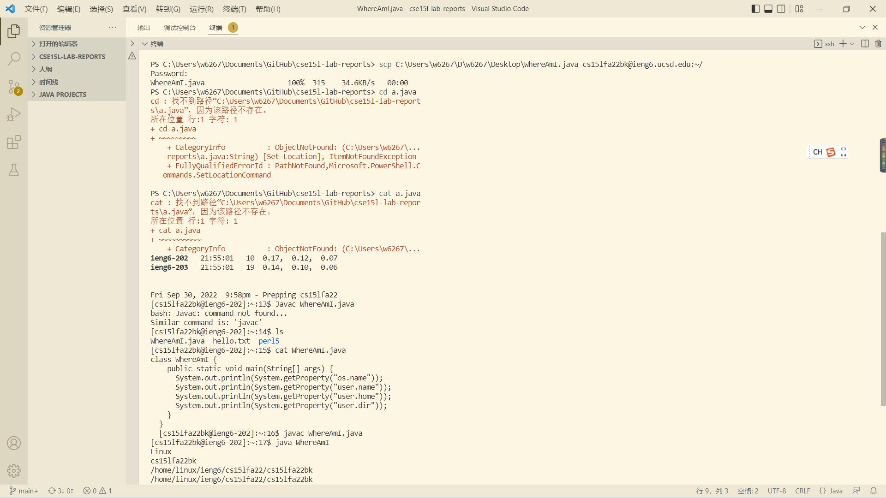

## STEP 1 Installing Visual Studio Code
Download website https://code.visualstudio.com/

## STEP 2 Remotely Connecting

## STEP 3 Run Some Commands

## STEP 4 Moving Files over SSH with scp

## STEP 5 SSH Keys

## STEP 6 Making Remote Running Even More Pleasant

