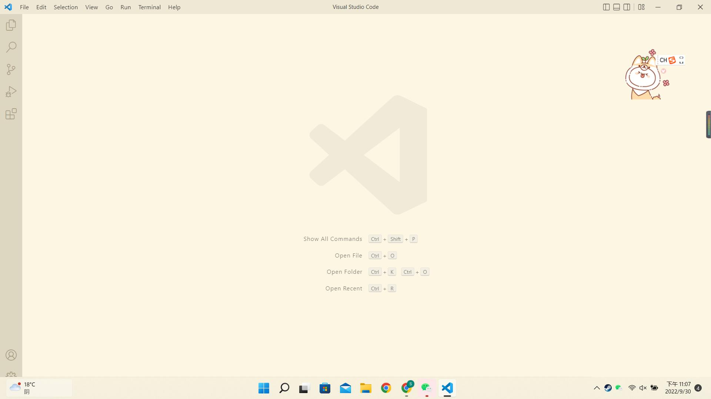
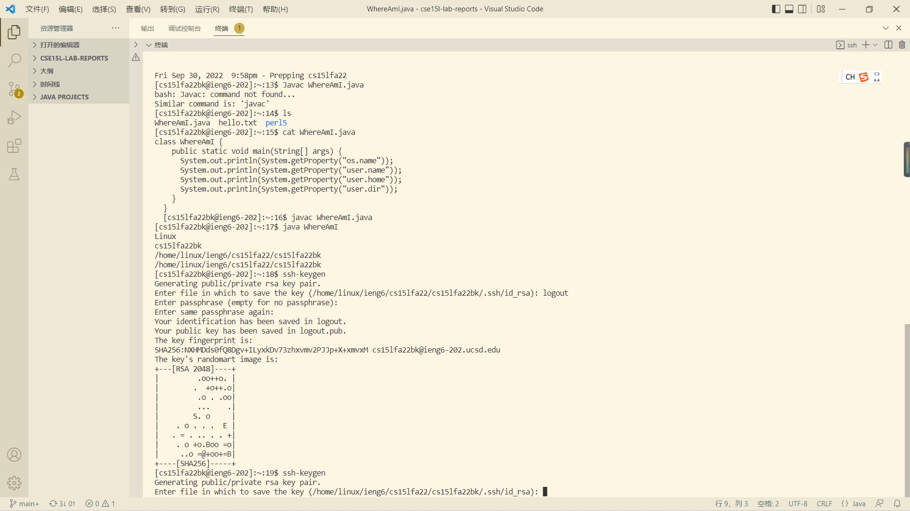
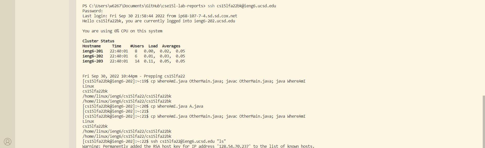

# LAB 1 Learn about how to using VScode and login student account
## STEP 1 Installing Visual Studio Code
Download website https://code.visualstudio.com/

## STEP 2 Remotely Connecting
I spent a lot of time here because I forgot my password and spent a lot of time getting it back

## STEP 3 Run Some Commands
Try run some commands:
- cd~
- cd
- ls
- ls -lat
- ls -a

## STEP 4 Moving Files over SSH with scp
When I run it on the client and server, the WhereAmI file will show that the file cannot be found, and vscode prompts me that I have not downloaded the JDK

## STEP 5 SSH Keys

## STEP 6 Making Remote Running Even More Pleasant

